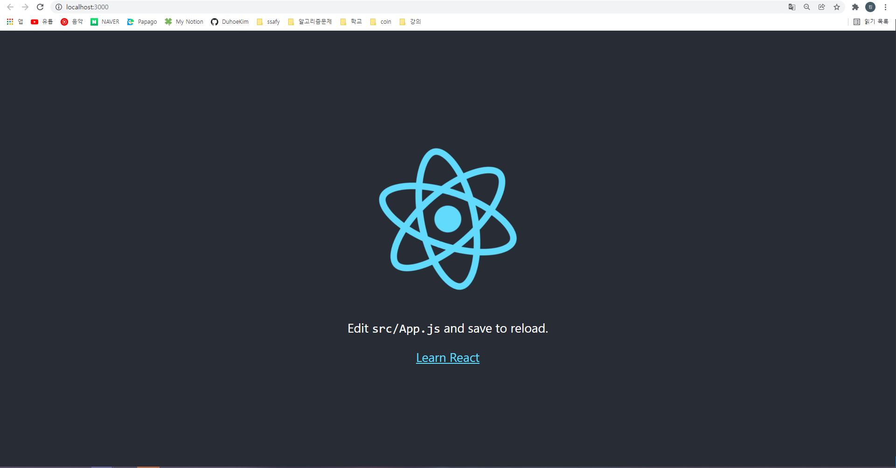

# React 공부하기

## Create React App

```bash
npx create-react-app my-app
cd my-app
npm start
```

> Node 14.0.0 혹은 상위 버전 및 npm 5.6 혹은 상위 버전이 필요

## src/ 폴더의 소스 삭제

* 기본 소스들이 담겨 있으므로 삭제하고 프로젝트에 필요한 코드를 추가!

### 초기 폴더 구조 및 실행 화면





## React 컴포넌트 클래스 or React 컴포넌트 타입

```react
class ShoppingList extends React.Component {
  render() {
    return (
      <div className="shopping-list">
        <h1>Shopping List for {this.props.name}</h1>
        <ul>
          <li>Instagram</li>
          <li>WhatsApp</li>
          <li>Oculus</li>
        </ul>
      </div>
    );
  }
}
```

*  ShoppingList는 **React 컴포넌트 클래스** 또는 **React 컴포넌트 타입**
* 개별 컴포넌트는 `props`라는 매개변수를 받아오고 `render` 함수를 통해 표시할 뷰 계층 구조를 반환

### render 함수

* `render` 함수는 화면에서 보고자 하는 *내용*을 반환

* 특히 `render`는 렌더링할 내용을 경량화한 **React 엘리먼트**를 반환

* 위의 예시코드에서,  <div /> 구문은 빌드하는 시점에서 React.createElement('div')로 변환

  * ```react
    return React.createElement('div', {className: 'shopping-list'},
      React.createElement('h1', /* ... h1 children ... */),
      React.createElement('ul', /* ... ul children ... */)
    );
    ```

    

### JSX

* React의 특수한 문법
* JSX 내부의 중괄호 안에 *어떤* JavaScript 표현식도 사용가능
* React 엘리먼트는 JavaScript 객체이며 변수에 저장하거나 프로그램 여기저기에 전달가능


## props 보내기

```react
class Board extends React.Component {
  renderSquare(i) {
    return <Square value={i} />;
  }
}
```

* 컴포넌트의 속성으로 props 를 보낼 수 있다.

  * 하위 컴포넌토는 `this.props.{속성명}` 으로 사용 가능하다.

    * ex)

      ```react
      class Square extends React.Component {
        render() {
          return (
            <button className="square">
              {this.props.value}
            </button>
          );
        }
      }
      ```


## 이벤트 발생 시 함수 실행하기

```react
class Square extends React.Component {
 render() {
   return (
     <button className="square" onClick={() => console.log('click')}>
       {this.props.value}
     </button>
   );
 }
}
```

* `onClick` 이라는 속성을 사용
  * 원하는 이벤트에 맞는 속성명 설정하기

> Vue와 비슷한 듯 ?

### 결과


* 클릭하면 콘솔 창에 `click` 이라는 문구가 출력되는 것을 확인할 수 있다.


## state로 데이터 저장하기

```react
class Square extends React.Component {
  constructor(props) {
    super(props);
    this.state = {
      value: null,
    };
  }

  render() {
    return (
      <button className="square" onClick={() => console.log('click')}>
        {this.props.value}
      </button>
    );
  }
}
```

> 주의!
>
> * [JavaScript 클래스](https://developer.mozilla.org/en-US/docs/Web/JavaScript/Reference/Classes)에서 하위 클래스의 생성자를 정의할 때 항상 `super`를 호출해야한다.
> * 모든 React 컴포넌트 클래스는 `생성자`를 가질 때 `super(props)` 호출 구문부터 작성해야 한다.

* `this.props.value`  => `this.state.value`로 변경하기
* `onClick={...}` 이벤트 핸들러를 `onClick={() => this.setState({value: 'X'})}`로 변경하기

* 속성들을 가독성이 좋게 linebreak 하기

### 결과

#### 코드

```react
class Square extends React.Component {
  constructor(props){
    super(props)
    this.state = {
      value: null,
    }
  }

  render() {
    return (
      <button
        className="square"
        onClick={() => this.setState({value: 'X'})}
      >
        {this.state.value}
      </button>
    );
  }
}
```

#### 실행결과


## 부모 컴포넌트에서 state 관리하기

> Vue와 마찬가지로 데이터 흐름을 명확하게 하고, 버그와 리팩토링에 강점을 가지기 위해서 부모가 state를 관리하는 것이 좋다.

```react
class Square extends React.Component {
  render() {
    return (
      <button
        className="square"
        onClick={() => this.props.onClick()}
      >
        {this.props.value}
      </button>
    );
  }
}

class Board extends React.Component {
  constructor(props) {
    super(props);
    this.state = {
      squares: Array(9).fill(null),
    };
  }

  handleClick(i) {
    const squares = this.state.squares.slice()
    squares[i] = 'X'
    this.setState({squares:squares})
  }

  renderSquare(i) {
    return (
    <Square
      value={this.state.squares[i]} 
      onClick={() => this.handleClick(i)}
    />
    )
  }

  render() {
    const status = 'Next player: X';

    return (
      <div>
        <div className="status">{status}</div>
        <div className="board-row">
          {this.renderSquare(0)}
          {this.renderSquare(1)}
          {this.renderSquare(2)}
        </div>
        <div className="board-row">
          {this.renderSquare(3)}
          {this.renderSquare(4)}
          {this.renderSquare(5)}
        </div>
        <div className="board-row">
          {this.renderSquare(6)}
          {this.renderSquare(7)}
          {this.renderSquare(8)}
        </div>
      </div>
    );
  }
}
```

### slice를 사용하는 이유 : 불변성의 장점

#### 복잡한 특징들을 단순하게 만듦

* 직접적인 데이터 변이를 피하는 것은 이전 버전의 게임 이력을 유지하고 나중에 재사용할 수 있게 만든다.

#### 변화를 감지함

* 불변 객체에서 변화를 감지하는 것이 더욱 용이함

#### React에서 다시 렌더링하는 시기를 결정함

* 불변성의 가장 큰 장점은 React에서 *순수 컴포넌트*를 만드는 데 도움을 준다
* 변하지 않는 데이터는 변경이 이루어졌는지 쉽게 판단할 수 있으며 이를 바탕으로 컴포넌트가 다시 렌더링할지를 결정할 수 있다.


## 함수 컴포넌트

* 더욱 간단한 컴포넌트 방식

* `state` 없이 `render` 함수만을 가진다. 

```react
function Square(props) {
  return (
    <button className="square" onClick={props.onClick}>
      {props.value}
    </button>
  );
}
```

